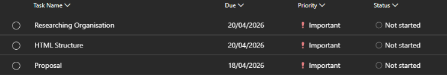
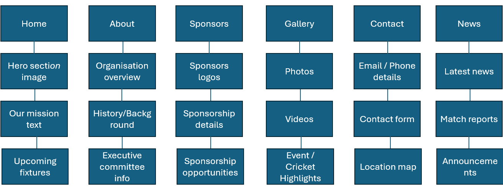

# Website

Project Title:

WEDE5020w POE

Student information: 

Full Name: Liam David Kaal
Number: ST10499386

Website Goals and Objectives:

● Increase awareness of the organisation
● Attract new players and volunteers
● Generate sponsorship and funding opportunities
● Share news, fixtures, and results
● Provide accessible information

Key Features and Fuctionality:

Essential Pages:
● Homepage
● About Us
● Teams & Players
● Fixtures & Results
● News & Events
● Gallery
● Get Involved
● Sponsors
● Contact Page

Functionality:
● Online registration forms
● Newsletter signup
● Social media integration
● Mobile-friendly design
● Accessibility features

Timeline and Milestone:

Site Map:

CHANGES MADE:

Updated Timeline based on feedback: 

Updated Site Map based on feedback: 

Added images to the website and css styling. Based on my feedback I had to make changes to the timeline and site map. The content of part 1 was lacking which I also have made changes to improve. I have created more commits to ensure there are commits. 

Added a hosting for the website in Github pages

References:

The mission statement on the index.html file line 33-34 - 
Western Province Deaf Cricket (n.d.) Our Mission. Available at: https://wpdeafcricket.co.za (Accessed: 20 April 2026).

All images are provided by the Western Province Deaf Cricket Team or taken by me. 

